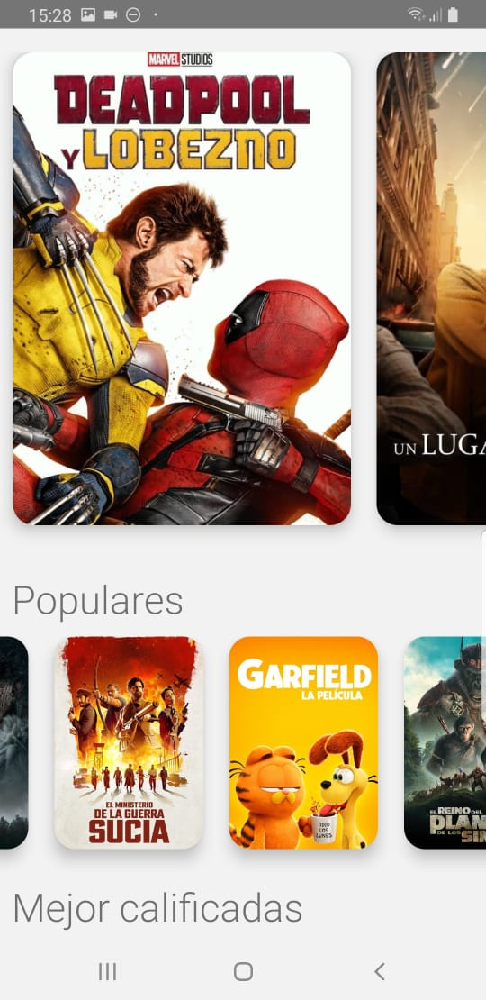
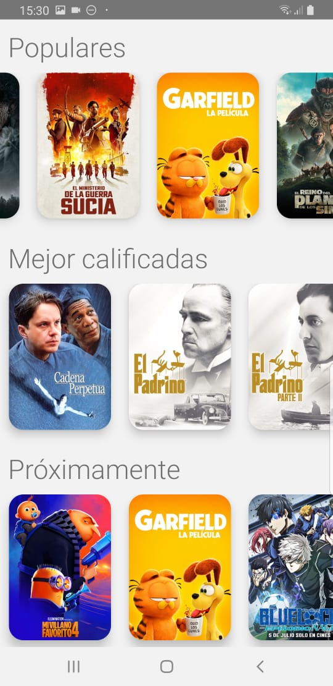
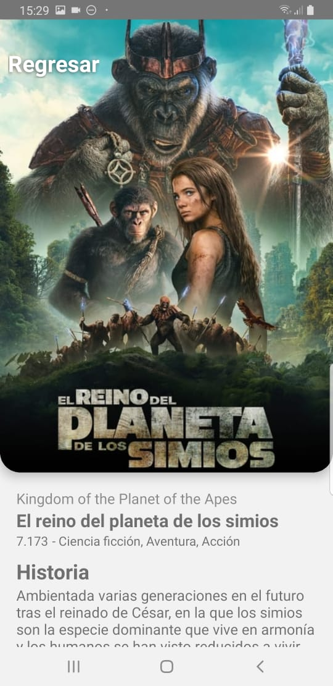
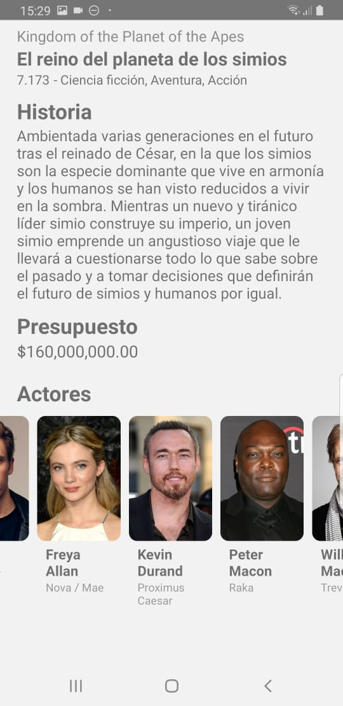

# Movies App

## Descripción
Esta es una aplicación de películas desarrollada en React Native. Permite ver información sobre películas populares, incluyendo detalles y actores. El proyecto incluye navegación mediante stacks, un carrusel con un FlatList sin dependencias, y scroll horizontal infinito. Proyecto del curso de React Native de Fernando Herrera en Udemy.

## Instalación

### Prerrequisitos
- Node.js >= 18
- React Native CLI
- Android Studio (para desarrollo en Android) o Xcode (para desarrollo en iOS)

### Pasos
1. Clona el repositorio:
   ```bash
   git clone https://github.com/tu-usuario/moviesApp.git
   cd moviesApp
2. Instala las dependencias:
   ```bash
   npm install
3. Instala las dependencias:
   ```bash
   npm start
4. Para correr en Android:
   ```bash
   npm run android
5. Para correr en iOS:
   ```bash
   npm run ios

### Uso
- Abre la aplicación en tu emulador o dispositivo.
- Navega por las distintas secciones para ver películas populares, detalles de películas y actores.

## Capturas de Pantalla

Aquí hay algunas capturas de pantalla de la aplicación en funcionamiento:

### Pantalla Principal

<p align="center">
  
  
</p>
<p align="center">
  Pantalla principal de la aplicación mostrando el carrusel de películas populares.
</p>

### Detalle

<p align="center">
  
  
</p>
<p align="center">
  Pantalla de detalles mostrando información detallada sobre una película.
</p>

## Contacto

Juandi - [GitHub](https://github.com/JuandiAndrade) - [LinkedIn](https://www.linkedin.com/in/juan-diego-andrade-polimeni-1a4501249/) - [juandi.andrade.g@gmail.com](mailto:juandi.andrade.g@gmail.com)
